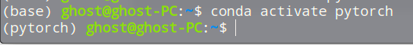
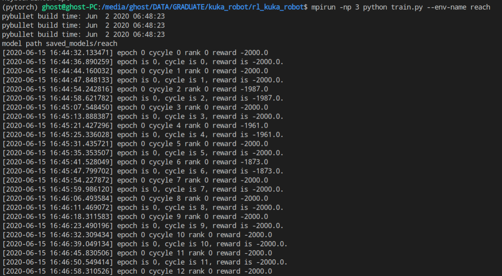

# RL kuka robot

## Overview

[TOC]

- [RL kuka robot](#rl-kuka-robot)
    - [Overview](#overview)
    - [安装](#安装)
        - [1.conda安装](#1-conda安装)
        - [2.安装mpi](#2-安装mpi)
        - [3.安装环境](#3-安装环境)
    - [训练](#训练)
    - [项目结构](#项目结构)
    - [Kuka Env](#kuka-env)
    - [参考链接](#参考链接)


## 安装

运行环境

- deepin x64 15.11桌面版 Ubuntu也可

### 1. conda安装

安装conda

[anaconda下载地址](https://www.anaconda.com/products/individual#linux)

下载之后进入安装

```shell
sudo sh ./Anaconda3-2020.02-Linux-x86_64.sh
```

安装完之后编辑`~/.bashrc`文件，在最后面添加，保存退出后，`source ~/.bashrc`生效

```shell
export PATH=/home/aeasringnar/anaconda3/bin:$PATH
```

测试

```shell
conda list
```


### 2. 安装mpi

```shell
sudo apt-get install mpich
```

检测是否安装成功，如果输出安装路径，就显示安装成功，没有的话需要将mpi的bin目录添加在PATH环境变量

```shell
which mpicc
```

尝试运行

```shell
(base) ghost@ghost-PC:~$ mpirun -np 3 python helloworld.py 
hello world
hello world
hello world
```

### 3. 安装环境

移动到项目目录下

```shell
conda env create -f freeze.yml
```

创建项目pytorch，创建环境的过程需要十几分钟到几十分钟，视网络状况而定。

激活环境

```shell
conda activate pytorch
```



## 训练

运行`train.py`文件，参数可参考`arguments.py`文件

reach实验训练，her版本， --replay-strategy参数默认就是future，可以不写

```shell
python train.py --env-name reach --replay-strategy future
```

reach实验训练，非her版本，--replay-strategy的参数随便写一个就行，future之外就行

```shell
python train.py --env-name reach --replay-strategy normal
```

多线程运行暂时还有点问题，表现为print异常，需要等许久才有输出，多线程版本需要debug和验证

```shell
mpirun -np 6 python train.py --env-name reach
```

如图，可以输出，存在一定问题（过了很久不输出，一段时间后大量输出，不清楚原因）



训练完之后的模型会保存在文件夹`saved_models`下

调用对应的模型

```shell
python demo.py --env-name reach
```

调用blockreach模型

```python
python demo.py --env-name blockreach_her
```

调用有三个障碍物的reach环境，默认的障碍物数量为3，如果数字不对，会提示模型不匹配，输入不匹配，因为observation会加入障碍物的位置信息，因此observation的长度与障碍物数量有关

```python
python demo.py --env-name obreach3_her --obs-num 3
```


环境调用代码，--env-name参数调用对应的环境，reach_her和reach， reach*都是调用reach环境 

```python
if args.env_name.startswith('reach'):
    env = kukaReachGymEnvHer(renders=rend,reward_type=1)
elif args.env_name.startswith('push'):
    env = kukaPushGymEnvHer(renders=rend, reward_type=1)
elif args.env_name.startswith('obreach'):
    env = kukaReachGymEnvOb(renders=rend,reward_type=1,obstacles_num=args.obs_num)
elif args.env_name.startswith('blockreach'):
    env = kukaReachGymEnvblock(renders=rend,reward_type=1)                           
else:
    env = kukaReachGymEnvHer(renders=rend,reward_type=1)
                            
```


## 项目结构

```python
(pytorch) ghost@ghost-PC:/media/ghost/DATA/GRADUATE/kuka_robot$ tree .
.
├── freeze.yml			# 项目的环境依赖
├── requirements.txt	# 同上，但只打包了pip环境，不全
├── __init__.py
├── README.md			#
├── rl_kuka_robot
│   ├── algos						# 算法部分
│   │   ├── arguments.py			# 输入参数获取，用于解析输入的指令中的参数
│   │   ├── ddpg.py					# ddpg本体，是实验所用版本
│   │   ├── her.py					# her算法，将从replay buffer中采样的数据进行her转化返回
│   │   ├── models.py				# ddpg中网络的模型，描述了actor网络和critic网络
│   │   ├── normalizer.py			# 
│   │   ├── replay_buffer.py		# 经验回放池，由obs,ag,g,action组成
│   │   └── utils.py				# 
│   ├── envs						# 环境文件夹，记录实验所需的各种环境
│   │   ├── kuka_gym_env.py			# 由kuka机器人，桌子等组成共同环境信息，实验环境在这上定制
│   │   ├── kukakr6.py				# kuka机器人本体
│   │   ├── kuka_pick_gym_env_her.py
│   │   ├── kuka_push_gym_env_her.py
│   │   ├── kuka_push_gym_env.py
│   │   ├── kuka_reach_gym_env_her.py
│   │   ├── kuka_reach_gym_env_obstacle.py
│   │   ├── kuka_reach_gym_env.py	# 基本选her环境就行了，其他环境早期做的，有点多余
│   │   ├── kuka_reach_obs.py
│   ├── helloworlds
│   │   └── hellokuka.py			# helloworld
│   ├── robot_data					# 记录机械臂urdf等信息的文件夹
│   │   ├── __init__.py
│   │   ├── kuka_kr6_support
│   │   │   ├── block.urdf			# 记录臂章实验中挡板的信息
│   │   │   ├── CMakeLists.txt
│   │   │   ├── config
│   │   │   ├── cube.obj			
│   │   │   ├── cube_small.urdf		# 表示目标位置信息，去掉了碰撞信息，所以可以作为目的地使用
│   │   │   ├── cube.urdf			# 记录push环境中被推动的物块的信息
│   │   │   ├── launch
│   │   │   ├── meshes				# 材质信息
│   ├── saved_models				# 保存的模型在这个文件夹中
│   │   └── reach
│   ├── test_envs					# 测试自己写的环境是否正确
│   │   ├── draw.py
│   │   ├── test_kuka_push_gym_env_her.py
│   │   ├── test_kuka_push_gym_env.py
│   │   ├── test_kuka_reach_gym_env_her.py
│   │   ├── test_kuka_reach_gym_env_obstacle.py
│   │   ├── test_kuka_reach_gym_env.py
│   │   └── test_kuka_reach_obs.py
│   └── train.py					# 训练，main
│   ├── demo.py						# 回放，加载模型，测试结果
├── rl_kuka_robot.egg-info
└── setup.py						#
└── helloworld.py					

```

> 这里删除了一些多余的目录显示

## Kuka Env

- `Action Space`: joints space 关节空间 6DOF 
- `Obervation Space`: 
  - observation: 观察到的数据，包括末端机械手位置和方向，各关节位置和方向，以及物块的位置信息，视具体环境而定。
  - achieved_goal: 目前已实现的位置，视具体实验环境而定，在Reach环境中，这里是机械臂末端的位置信息，在Push环境中，这里是需要移动的物块的位置信息。
  - desired_goal:  想要达到的目标，在reach和Push环境中，这里是到达的目标的位置。

代码演示：

```python
In [1]: from rl_kuka_robot.envs.kuka_reach_gym_env_her import kukaReachGymEnvHer     
In [2]: env = kukaReachGymEnvHer()
    
In [3]: env.action_space                                                             
Out[3]: Box(6,)

In [4]: env.observation_space                                                         
Out[4]: Dict(achieved_goal:Box(3,), desired_goal:Box(3,), observation:Box(18,))

In [5]: env.reset()                                                                   
Out[5]: 
OrderedDict([('observation',
              array([ 6.0287442e-01,  8.5497925e-03,  8.9616656e-01,  3.1415869e+00,
                      5.7070784e-01,  3.1415785e+00, -2.7867408e-05,  6.2638079e-02,
                     -2.1236501e-04, -5.6678802e-04,  2.4783145e-04,  3.6308413e-04,
                      5.5322133e-06, -4.9958824e-01,  1.4997824e+00,  4.7487758e-06,
                     -1.04202154e-04, -9.66595420e-06])),
             ('achieved_goal', array([0.60287424, 0.00856498, 0.89616966])),
             ('desired_goal', array([0.7 , 0.  , 0.64]))])

In [6]: a = env.action_space.sample()          

# step()函数参照gym，返回observation, reward, done, info,请自定义返回数据
In [7]: env.step(a)
Out[7]: 
(OrderedDict([('observation',
               array([ 6.0287416e-01,  8.8259717e-03,  8.9616771e-01,  3.1415850e+00,
                       5.7006812e-01,  3.1415128e+00, -6.6346676e-01, -4.6950857e-01,
                      -5.7946187e-01,  1.0089750e+00,  1.5425249e+00, -2.4359600e+00,
                       3.5779390e-03, -4.9883627e-01,  1.5067484e+00,  5.5078385e-03,
                      -1.43319071e-03, -1.33065362e-02])),
              ('achieved_goal', array([0.60287413, 0.00882597, 0.89616877])),
              ('desired_goal', array([0.7 , 0.  , 0.64]))]),
 				-1.0,
 				False,
 				{'is_success': False})
```

Observation的代码

```python
    # 这是公共的观察数据，在文件kukakr6.py中
    def getObservation(self):
        observation = []
        # 获取末端信息，返回的state中包含多个数据
        state = p.getLinkState(self.kukaId, self.endEffLink, computeLinkVelocity=1)
        pos = state[0]
        orn = state[1]
        euler = p.getEulerFromQuaternion(orn)
        observation.extend(list(pos))
        observation.extend(list(euler))  # roll, pitch, yaw
        # 这个暂时没有用上
        if (self.includeVelObs):
            velL = state[6]
            velA = state[7]
            observation.extend(list(velL))
            observation.extend(list(velA))

        jointStates = p.getJointStates(self.kukaId, range(6))
        jointPoses = [x[0] for x in jointStates]
        observation.extend(list(jointPoses))

        return observation
    
	# 以reach环境为例，除了公共的观察数据，添加物体object 的位置信息，这里作为desired_goal
    # 不同的环境根据需求进行设置
    # 所在文件envs.kuka_reach_gym_env_her.py
    def getExtendedObservation(self):
        # get robot observations
        observation = self._kuka.getObservation()
        objPos, objOrn = p.getBasePositionAndOrientation(self._objID)

        endEffPose = list(observation[0:3])

        return OrderedDict([
            ('observation', np.asarray(list(observation).copy())),
            ('achieved_goal', np.asarray(endEffPose.copy())),
            ('desired_goal', np.asarray(list(objPos).copy()))
        ])
```


reward设置代码，以reach实验为例

```python
    # 输入的数据为二维数组，大小是batch_size*length
    def compute_reward(self, achieved_goal, desired_goal, info):
        d = goal_distance(np.array(achieved_goal), np.array(desired_goal))
        # 稀疏型奖励
        if self.reward_type == 1:
            return -(d > self._target_dist_min).astype(np.float32)
        # 密集型奖励
        elif self.reward_type == 2:
            return -d
       	# 任务成功额外奖励100
        else:
            index = d < self._target_dist_min
            result = -(d).astype(np.float32)
            result[index] += 100
            # print(result)
            return result
```


## 参考链接

1. <https://github.com/alishbaimran/Robotics-DDPG-HER>
2. <https://github.com/robotology-playground/pybullet-robot-envs>
3. 


> [ppoRobotPath](https://github.com/kavehkamali/ppoRobotPath)项目也是使用pybullet和kuka机器人进行训练，但使用的是PPO算法，效果很好，建议可以学习一下。